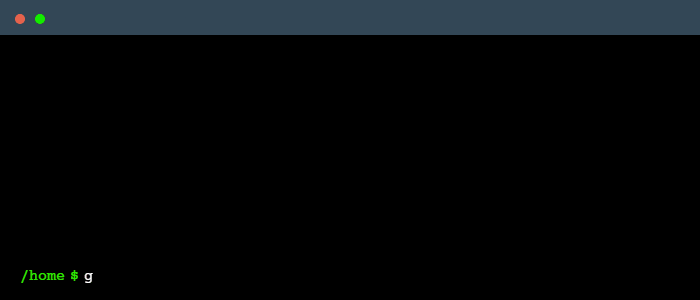

# MQTwister

<div align="center">

***A Tool for Man-in-the-Middle (MitM) Attacks on the MQTT Protocol.***

[](<#> "Python")
[](<LICENSE> "License")
[](<https://github.com/danielfeitopin/mqtwister> "Issues")
[](<https://github.com/danielfeitopin/mqtwister/stargazers> "Stars")

<div align="center" width="90%">



</div>

</div>

## Table of Contents

- [MQTwister](#mqtwister)
  - [Table of Contents](#table-of-contents)
  - [Setup](#setup)
    - [Using `requirements.txt`](#using-requirementstxt)
    - [Using `Pipenv`](#using-pipenv)
  - [Usage](#usage)
  - [License](#license)
  - [Contributing](#contributing)
  - [Contact](#contact)

## Setup

### Using `requirements.txt`

For a classic installation, the file [`requirements.txt`](requirements.txt) is provided.

1. Clone the repository:
    ```sh
    git clone https://github.com/danielfeitopin/mqtwister.git
    cd mqtwister
    ```

2. Create and activate a virtual environment:
    ```sh
    python -m venv .venv
    source .venv/bin/activate
    ```

3. Install dependencies:
    ```sh
    pip install -r requirements.txt
    ```

> [!NOTE]
> On Windows run `.venv\Scripts\activate` instead of `source .venv/bin/activate`.

### Using `Pipenv`

For added convenience, the files [`Pipfile`](Pipfile) and [`Pipfile.lock`](Pipfile.lock) are also provided.

1. Clone the repository:
    ```sh
    git clone https://github.com/danielfeitopin/mqtwister.git
    cd mqtwister
    ```

2. Install dependencies:
    ```sh
    pipenv install
    ```

## Usage

1. Configure the tool by editing the [`mqtwister/config.py`](mqtwister/config.py) file:

    ```python
    INTERFACE_NAME = '' # E.g. 'eth0' (Debian), 'Ethernet' (Windows), 'Wi-Fi' (Windows)
    TARGET_IP = ''
    ```

<!-- 1. Use `etterfilter` to compile the filter script:

    ```sh
    etterfilter filter.ecf -o filter.ef
    ``` -->

2. Run the tool using the package as a module:

    ```sh
    python -m mqtwister
    ```

> [!IMPORTANT]
> - Be sure to execute the command inside the virtual environment (if used).
> - Ensure you have the necessary permissions to run network sniffing tools.

> [!TIP]
>
> There is a useful function in [`mqtwister/utils/network.py`](mqtwister/utils/network.py) to get a list of the available network interfaces: `get_interfaces()`.
>
> ```sh
> python -c "import mqtwister.utils.network as net; print(net.get_interfaces())"
> ```

## License

This project is licensed under the [GNU General Public License version 3](<https://opensource.org/license/gpl-3-0>). A copy of this license can be found in [LICENSE](<LICENSE>).

<details>
<summary>Why this license?</summary>

The decision to license this project under the GNU General Public License version 3 (GPLv3) is based on legal compatibility, ethical considerations, and long-term sustainability. Furthermore, given that the project incorporates dependencies licensed under GPLv2 and BSD-3-Clause, GPLv3 ensures compliance while preserving the core principles of open-source software.

Regarding the GPLv2-licensed dependency, the compatibility depends on whether it is distributed under "GPLv2 or later" or strictly "GPLv2 only." As this is the former case, adopting GPLv3 is a legally valid choice that allows for greater flexibility.

The inclusion of BSD-3-Clause-licensed components does not pose a conflict, as BSD-licensed software can be freely integrated into GPL-licensed projects. The permissive nature of BSD-3-Clause allows its code to be incorporated into projects under more restrictive copyleft licenses, such as GPLv3, without violating its terms.

</details>

## Contributing

Contributions are welcome! If you have improvements, or bug fixes, feel free to submit a pull request.

## Contact

Feel free to get in touch with me!

<div align="center">

[](<https://github.com/danielfeitopin>)
[](<https://www.linkedin.com/in/danielfeitopin/>)

</div>
