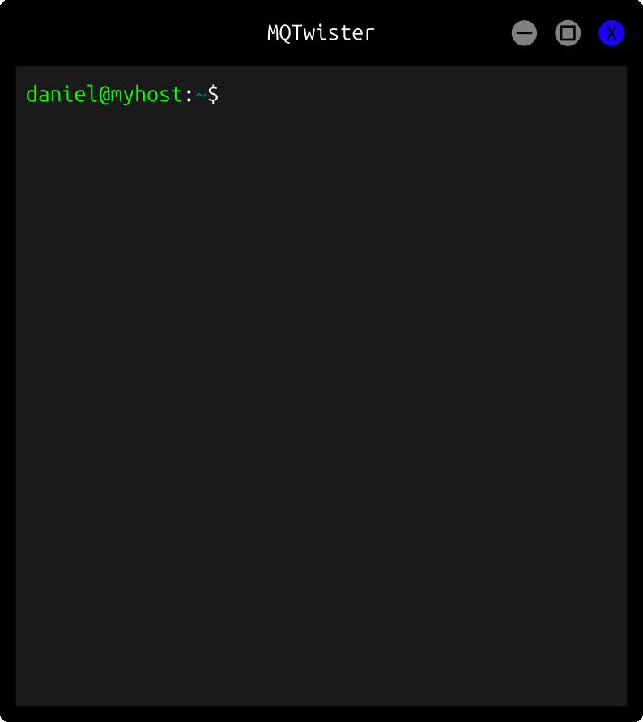

<!-- SPDX-FileCopyrightText: 2026 Daniel Feito-Pin <danielfeitopin+github@protonmail.com>

SPDX-License-Identifier: CC-BY-SA-4.0 -->

# MQTwister

<div align="center">

***A Tool for Man-in-the-Middle (MitM) Attacks on the MQTT Protocol.***

[](<#> "Python")
[](<LICENSE> "License")
[](<https://github.com/danielfeitopin/mqtwister/issues> "Issues")
[](<https://github.com/danielfeitopin/mqtwister/pulls> "Pull Requests")
[](https://api.reuse.software/info/github.com/danielfeitopin/mqtwister)

[](<https://github.com/danielfeitopin/mqtwister/stargazers> "Stars")
[](<https://github.com/danielfeitopin/mqtwister/watchers> "Watchers")
[](<https://github.com/danielfeitopin/mqtwister/forks> "Forks")

</div>

## Table of Contents

- [MQTwister](#mqtwister)
  - [Table of Contents](#table-of-contents)
  - [About this project](#about-this-project)
  - [Setup](#setup)
    - [Using `requirements.txt`](#using-requirementstxt)
    - [Using `Pipenv`](#using-pipenv)
  - [Usage](#usage)
  - [License](#license)
  - [Contributing](#contributing)
  - [Support this project](#support-this-project)
  - [Contact](#contact)

## About this project

MQTwister is an open-source tool for performing Man-in-the-Middle attacks on IoT systems based on the MQTT protocol.

To do this, MQTwister scans incoming packets and applies user-defined substitution rules in real time using its own syntax. In the case of connection packets, MQTwister also records the credentials (ID, username, and password), allowing for network information gathering.

MQTwister is primarily focused on packet processing and is expected to be used after performing the necessary preliminary actions to allow the running machine to intercept communication between an MQTT client and the broker.

> [!TIP]
>
> To interpose the attacker system between the targets' communications, tools as `ettercap` can be used.
> <details>
> <summary>See an example</summary>
>
> ___
> 
> The following filter logs and drops the received MQTT traffic (assuming the default port, 1883). With this filter, `ettercap` won't forward the MQTT's packets, leaving its processing to `mqtwister`, and keeping the original messages from reaching their destination without applying changes to the device's operating system or kernel:
> 
> ```sh
> # Filename: mqtt_filter.ecf
> if (ip.proto == TCP && tcp.src == 1883) {
>         msg("\nReceived packet with src port 1883.\n");
>         drop();
> }
> if (ip.proto == TCP && tcp.dst == 1883) {
>         msg("\nReceived packet with dst port 1883.\n");
>         drop();
> }
> ```
> 
> It can be compiled with `etterfilter` as follows:
>
> ```sh
> etterfilter mqtt_filter.ecf -o mqtt_filter.ef
> ```
> And then it can be used with `ettercap` as shown in the following ARP Poisoning example:
>
> ```sh
> ettercap -T -i $INTERFACE -M arp:remote /$TARGET_IPS// /$BROKER_IP//$MQTT_PORT -F mqtt_filter.ef
> ```
> ___

> 
> </details>


## Setup

### Using `requirements.txt`

For a classic installation, the file [`requirements.txt`](requirements.txt) is provided.

1. Clone the repository:
    ```sh
    git clone https://github.com/danielfeitopin/mqtwister.git
    cd mqtwister
    ```

2. Create and activate a virtual environment:
    ```sh
    python -m venv .venv
    source .venv/bin/activate
    ```

3. Install dependencies:
    ```sh
    pip install -r requirements.txt
    ```

> [!NOTE]
> On Windows run `.venv\Scripts\activate` instead of `source .venv/bin/activate`.

### Using `Pipenv`

For added convenience, the files [`Pipfile`](Pipfile) and [`Pipfile.lock`](Pipfile.lock) are also provided.

1. Clone the repository:
    ```sh
    git clone https://github.com/danielfeitopin/mqtwister.git
    cd mqtwister
    ```

2. Install dependencies:
    ```sh
    pipenv install
    ```

## Usage

To use MQTwister follow the next steps:

1. Configure the tool by editing the [`mqtwister/config.py`](mqtwister/config.py) with your preferences (such as default network interface, target port, logging level and language).
2. Run the tool using the `mqtwister` package as a module:

    ```sh
    python -m mqtwister
    ```

<div align="center" width="90%">

<figure>
    
    <br>
    <figcaption>Terminal output showing the main menu.</figcaption>
</figure>


</div>

3. Configure session parameters using the user interface.
4. Add substitution rules using the _ad hoc_ syntax `item="value" item.action(args)`, in which "item" may be `topic` or `payload` and "action" one of the available options (more info in [substitution_rules.md](<./docs/substitution_rules.md>)).
5. Start the sniffer to begin the message tampering and credential collection. 

> [!IMPORTANT]
> - Be sure to execute the command inside the virtual environment (if used).
> - Ensure you have the necessary permissions to run network sniffing tools.

## License

📃 This project is and its code are licensed under the [GNU General Public License version 2 (GPL-2.0)](<./LICENSES/GPL-2.0-only.txt>). The documentation files and other resources are licensed under the [Creative Commons Attribution Share Alike 4.0 International License (CC-BY-SA-4.0)](<./LICENSES/CC-BY-SA-4.0.txt>). A copy of these licenses can be found in the [LICENSE] file, and in the [LICENSES] folder.

<div align="center">

| Permissions      | Conditions                     | Limitations |
| ---------------- | ------------------------------ | ----------- |
| 🟢 Commercial use | 🔵 Disclose source              | 🔴 Liability |
| 🟢 Distribution   | 🔵 License and copyright notice | 🔴 Warranty  |
| 🟢 Modification   | 🔵 Same license                 |             |
| 🟢 Private use    | 🔵 State changes                |             |

_Table based on [choosealicense.com](<https://choosealicense.com/licenses/gpl-2.0/>)_

</div>

<details>
<summary>Why this license?</summary>

___

The initial intention was to license this project under the GNU General Public License version 3 (GPLv3) due to its enhanced legal protections, ethical considerations, and long-term sustainability. However, after reviewing the dependencies, it was determined that one of them is licensed under "GPLv2 only," which is incompatible with GPLv3. 

To ensure compliance and compatibility with all dependencies, the project is licensed under GPLv2. This decision aligns with the licensing terms of the included components while preserving the principles of open-source software. The permissive BSD-3-Clause-licensed components used in the project remain compatible with GPLv2, as their terms allow integration into projects under more restrictive copyleft licenses.

___

</details>

<details>
<summary>Used dependencies and their licenses</summary>

___

<div align="center">

Third party packages:

|              Component               |                    License                     |
| :----------------------------------: | :--------------------------------------------: |
| [![psutil_badge]][psutil_repository] | [![psutil_license_badge]][psutil_license_file] |
|  [![scapy_badge]][scapy_repository]  |  [![scapy_license_badge]][scapy_license_file]  |

Third party dev-packages:

|              Component               |                    License                     |
| :----------------------------------: | :--------------------------------------------: |
| [![pytest_badge]][pytest_repository] | [![pytest_license_badge]][pytest_license_file] |

</div>

<!-- LINKS -->
[psutil_badge]: <https://img.shields.io/github/pipenv/locked/dependency-version/danielfeitopin/mqtwister/psutil>
[psutil_repository]: <https://github.com/giampaolo/psutil>
[psutil_license_badge]: <https://img.shields.io/github/license/giampaolo/psutil>
[psutil_license_file]: <https://github.com/giampaolo/psutil/blob/master/LICENSE>
[scapy_badge]: <https://img.shields.io/github/pipenv/locked/dependency-version/danielfeitopin/mqtwister/scapy>
[scapy_repository]: <https://github.com/secdev/scapy>
[scapy_license_badge]: <https://img.shields.io/github/license/secdev/scapy>
[scapy_license_file]: <https://github.com/secdev/scapy/blob/master/LICENSE>
[pytest_badge]: <https://img.shields.io/github/pipenv/locked/dependency-version/danielfeitopin/mqtwister/dev/pytest>
[pytest_repository]: <https://github.com/pytest-dev/pytest/>
[pytest_license_badge]: <https://img.shields.io/github/license/pytest-dev/pytest>
[pytest_license_file]: <https://github.com/pytest-dev/pytest/blob/master/LICENSE>
___

</details>

## Contributing

🤝 Contributions are welcome! If you have improvements or bug fixes, feel free to submit a pull request.

❓ For support, please refer to the [SUPPORT] file for details on how to get help with this project.

📜 Please make sure to review the [CONTRIBUTING] guidelines and the [GOVERNANCE] document before getting started.

✅ By participating in this project, you agree to abide by our [Code of Conduct].

🔒 Security is a top priority for this project. If you discover any vulnerabilities or have concerns regarding the security of this tool, please report them responsibly by following the [SECURITY] guidelines.

## Support this project

⭐ If you find this project useful, please consider giving it a star on [GitHub][repository]. Your support helps to improve and maintain the project!

## Contact

📧 Feel free to get in touch with me!

<div align="center">

[](<https://github.com/danielfeitopin>)
[](<https://www.linkedin.com/in/danielfeitopin/>)

</div>

<!-- LINKS -->
[repository]: <https://github.com/danielfeitopin/mqtwister>
[SUPPORT]: <SUPPORT.md>
[CONTRIBUTING]: <CONTRIBUTING.md>
[GOVERNANCE]: <GOVERNANCE.md>
[Code of Conduct]: <CODE_OF_CONDUCT.md>
[SECURITY]: <SECURITY.md>
[LICENSE]: <LICENSE>
[LICENSES]: <./LICENSES/>
